# Creación de un LAMP en una instancia EC2 de AWS
`LAMP es un conjunto de software usado en desarrollo de aplicaciones web. Es acrónimo de Linux, Apache, MariaDB (en mi caso) y PHP`

### Sobre una instancia EC2 de Ubuntu(Linux):
## Instalación de Apache:
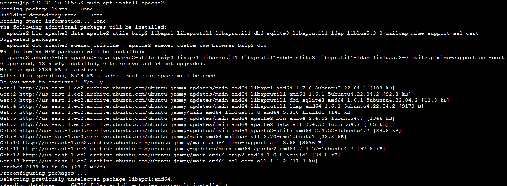

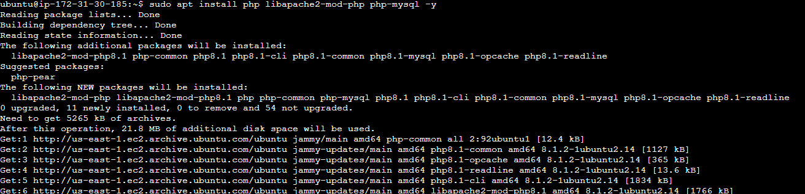

### Creo y añado el index.php al conf de Apache:
(mostraré mas adelante el resultado)

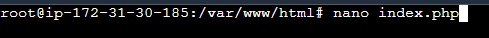

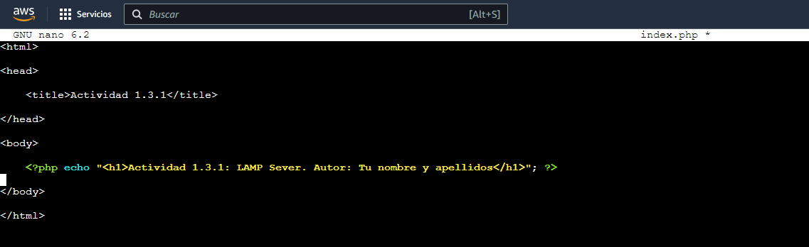

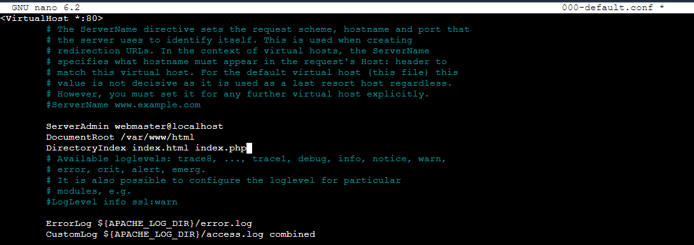

### Creo también info.php en `/var/www/html`:
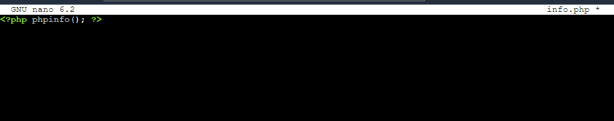

## Instalación de MariaDB:
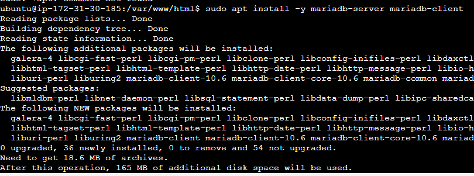

### Creo el usuario...
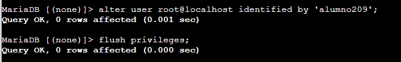

## Instalación de PHP:
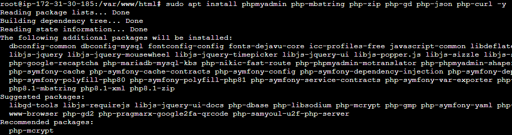

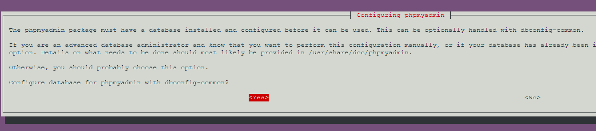

## Accedo al PHPmyAdmin:
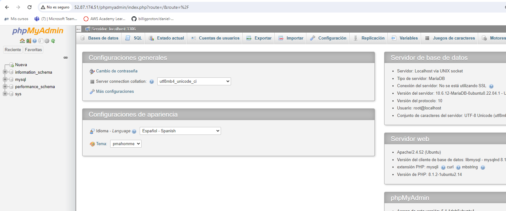

# Adminer:

## Instalación:
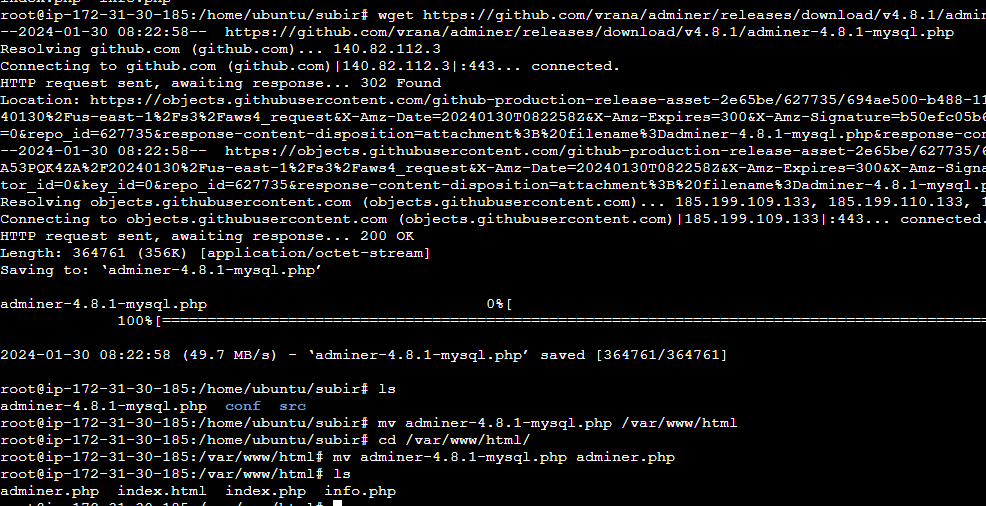

### Accedo desde el navegador a la base de datos:
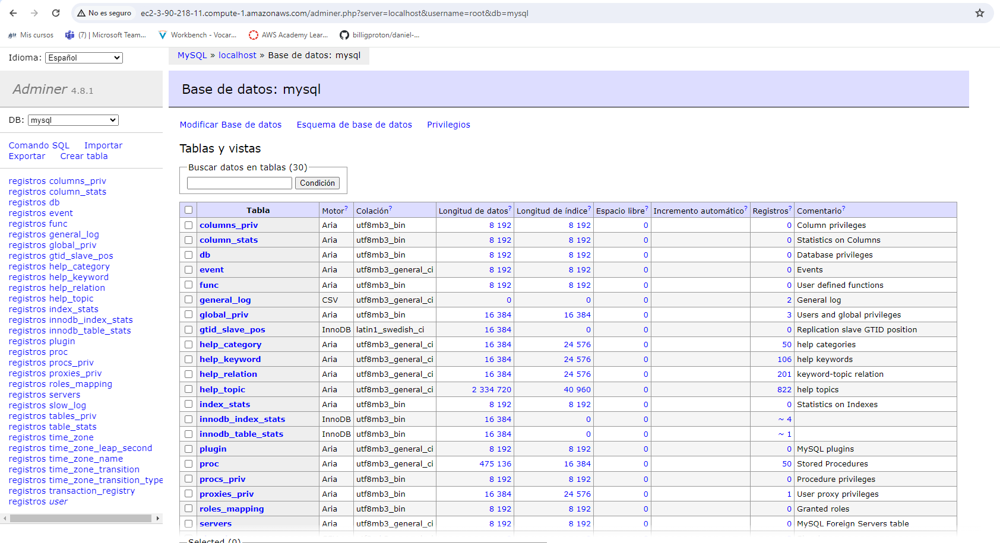

# Pruebas de acceso a los sitios creados en el servidor LAMP:

## Pagina por defecto Apache:
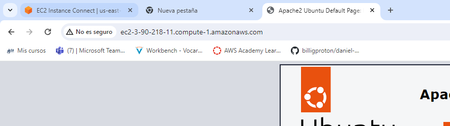

## Pagina de info.php:
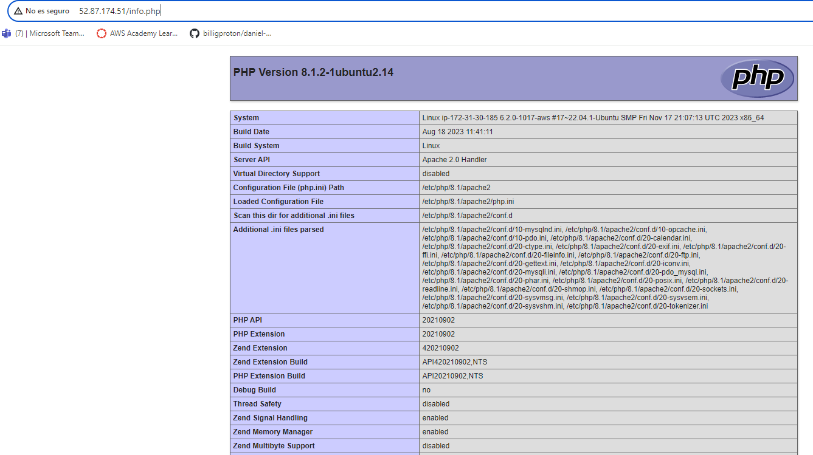

## Pagina de index.php:
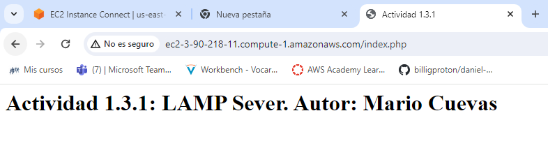

